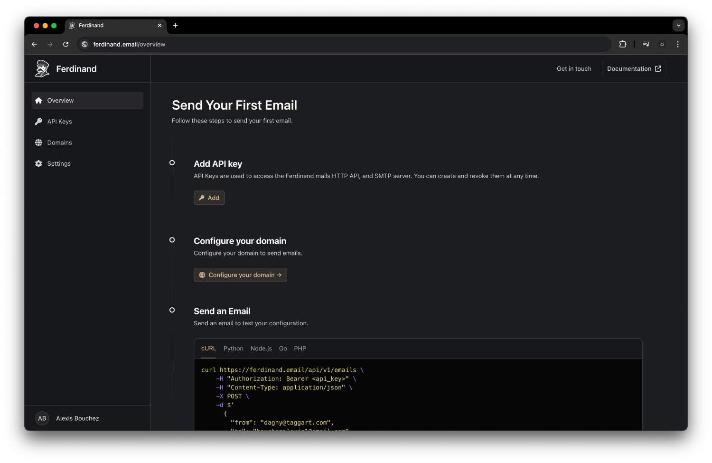

## Learn more about Ferdinand

To learn more about Ferdinand, you can check out the [FAQ](/faq).

## Get started with Ferdinand

To get started, create an account in the [dashboard](https://ferdinand.email/auth/sign_up). 

Or, if you prefer to self-host Ferdinand, you can follow the [self-hosting guide](/self-hosting).

Then, you will be able to configure your domails, API keys, and start sending emails. 

